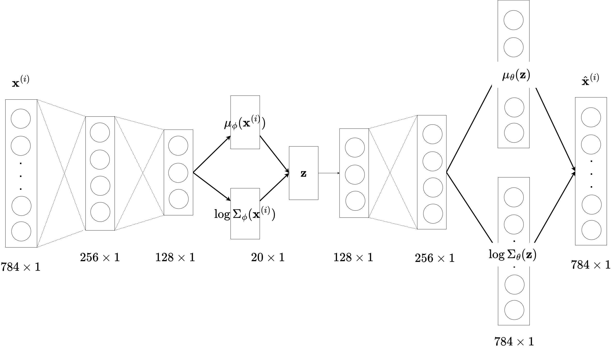
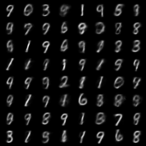
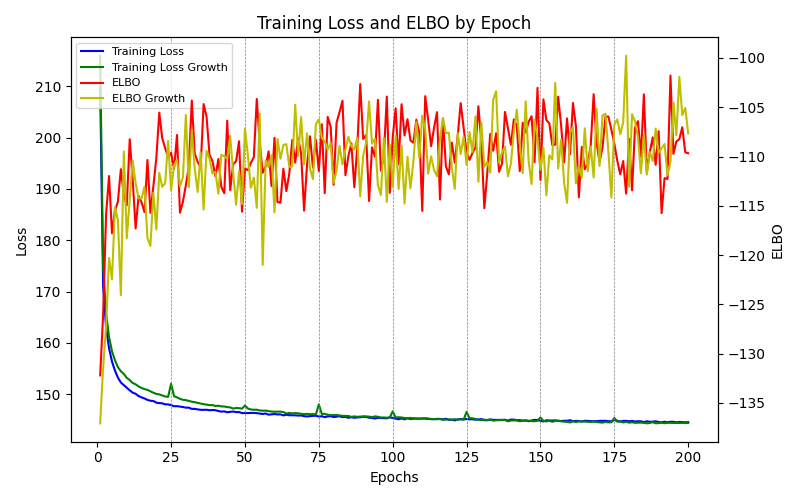
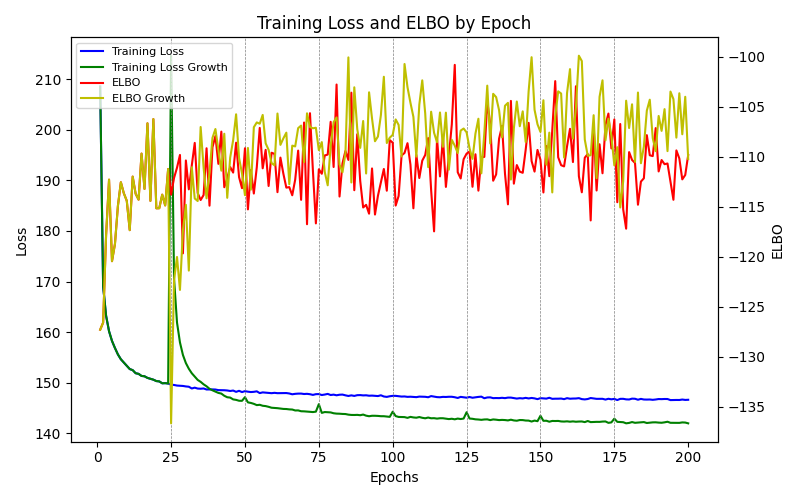

# Progressive Expansion of MLP Layers in Variational Autoencoders (VAEs)

## 1. Overview

This repository contains an implementation of an experimental approach to Variational Autoencoders (VAEs). It focuses on expanding the number of neurons in the dense encoder layers to assess the impact on model performance. The project demonstrates how a progressive increase in network capacity, tested on the MNIST dataset, affects both the reconstruction and generation of images.

## 2. Motivation

Modern generative models often benefit from increased capacity, but larger models may not always yield better performance for specific tasks. This work investigates whether targeted, incremental expansion within a VAE can lead to an optimized structure—delivering efficient and high-quality results without the overhead of excessively large networks.

## 3. Background

Variational Autoencoders (VAEs) are generative models that learn a probabilistic latent representation of data by maximizing the Evidence Lower Bound (ELBO). The ELBO is defined as:

```math
\text{ELBO} = \mathbb{E}_{q_{\phi}(z|x)}\left[\log p_{\theta}(x|z)\right] - KL\left(q_{\phi}(z|x) \parallel p(z)\right)
```

where:
- $q_{\phi}(z|x)$ is the approximate posterior,
- $p_{\theta}(x|z)$ is the likelihood, and
- $p(z)$ is the prior (typically a standard Gaussian).

Specifically, we investigate how adding neurons during training affects the balance between model capacity and performance. The approach leverages the reparameterization trick to enable efficient backpropagation through stochastic layers and employs mini-batch gradient descent with optimizers like Adam. Using the MNIST dataset, our experiments compare a progressively growing VAE against a fixed-structure model, focusing on both reconstruction and image generation tasks.

## 4. Architecture & Methodology

The architecture is based on a Variational Autoencoder (VAE) with an encoder and a decoder. The encoder transforms input images into a latent representation, while the decoder reconstructs the images. This project focuses on dynamically expanding the number of neurons in the encoder’s dense layers during training.

The initial setup is as follows:
- **Encoder:**  
  - Input: Flattened MNIST images (28×28)  
  - Two hidden layers with a small number of neurons  
  - Outputs parameters (mean and standard deviation) for the latent vector  
- **Latent Vector:**  
  - A low-dimensional latent space (e.g., 20 dimensions)  
  - The reparameterization is applied using:  
    ```math
    z = \mu_{\phi}(x) + \sigma_{\phi}(x) \odot \epsilon, \quad \epsilon \sim \mathcal{N}(0, I)
    ```
- **Decoder:**  
  - Two hidden layers transforming the latent representation back to the image space  
  - Reconstruction of the input image

**Figure 2** below illustrates the VAE architecture used in this project:

<div align="center">
  
</div>

The diagram shows the progression from the input image, through the two expanding encoder layers, reaching the latent representation, and finally reconstructing the image via the decoder.

During training, we employ the reparameterization trick to enable backpropagation through stochastic layers. 

The key methodological contribution of this project is the **expansion method**. At predefined iterations, neurons are added to the encoder’s hidden layers. New neurons are initialized using He initialization and integrated with the existing network architecture. This dynamic expansion aims to gradually increase the model’s capacity and improve performance without starting from an excessively large network.

## 5. Experiment and Results

Two experimental approaches were implemented using PyTorch to investigate the effect of expanding the encoder layers of the VAE model on MNIST. The training script (see `approach1.py` and `approach2.py`) sets up the VAE model with dynamic expansion, while the model code `model.py` provides the implementation of the expanding layers using He initialization.

### Experiment Setup

- **Dataset:** MNIST  
- **Libraries:** PyTorch, Torchvision, NumPy, tqdm, Matplotlib  
- **Configurations:**
  - Every 25 epochs, 32 and 16 neurons are added to the corresponding encoder layers.  
  - Training is performed over 200 epochs using Adam with a learning rate of 1e-3 and mini-batch size 128.  
  - **Approach 1:**  
    - Encoder starts with 32 neurons in the first hidden layer and 16 in the second, then gradually increase the number of neurons.  
  - **Approach 2:**  
    - The model is initialized from the target fixed structure (256 and 128 neurons in encoder's 2 layers respectively) and then suddenly reduced to 64 and 32 neurons at the first adjustment at the 25th epoch, following a similar growth strategy afterward.

- **Loss Function Components:**  
  - Binary Cross-Entropy (BCE) loss for reconstruction.  
  - Kullback–Leibler divergence (KL) between the approximate posterior and the prior.  
- **ELBO Estimation:**  
  - ELBO is computed by averaging over 20 samples from the latent space for each mini-batch during training (the reason behind unsmooth ELBO's graph pattern, compared with Losses' graph calculated by data points).

### 6. Results

The synthesized MNIST images generated by our VAE model are notably blurry and unclear. While some digits are formed correctly, others appear ambiguous with fused or mixed features. This observation is consistent with earlier discussions regarding the inherent blurriness observed in generative models (see Section 2.8.2, [Kingma & Welling, 2013](https://arxiv.org/pdf/1906.02691)). Additionally, our results indicate that there is no significant performance difference between the growing structure and the fixed model described in Section 3.

<div align="center">
  
</div>

In **Approach 1**, transient spikes in the loss function are observed immediately after each expansion event (vertical dashed lines in Figure 6). However, the loss quickly stabilizes and converges to levels comparable with a fixed structure model. The ELBO shows a consistent trend of improvement as the model capacity increases.

<div align="center">
  
</div>

In **Approach 2**, a notable initial loss spike is observed after the first expansion (as highlighted in Figure 7). After this moment, the loss decreases continuously and the ELBO increases, suggesting that the model better captures the data distribution post-expansion. Both approaches yield reconstructed images that are close to the original inputs, while generated images maintain a level of stochasticity commonly seen in VAE outputs.

<div align="center">
  
</div>

## 7. Threats to Validity

The following points summarize potential concerns regarding the validity of the experimental results:

- **Evaluation Metrics:**  
  - The assessment of performance was mainly based on the evolution of the training loss. We haven't yet developped a precise assessment of probabilistic stability using differents number of sampling $L$ in the latent space $z$.  
  - The measurement of reconstruction and generation quality remains qualitative.

- **Model Configuration:**  
  - The starting architecture and expansion parameters (number of neurons added) might affect convergence and stability.  
  - Limited analysis was conducted on the influence of individual neuron contributions.

- **Experimental Setup:**  
  - The experiments were performed on the MNIST dataset only; generalization to other datasets is not evaluated.  
  - The short training duration and fixed expansion schedule may overlook possible performance improvements with alternative strategies.


